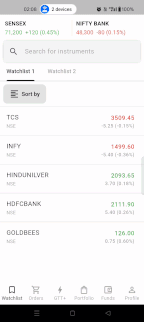
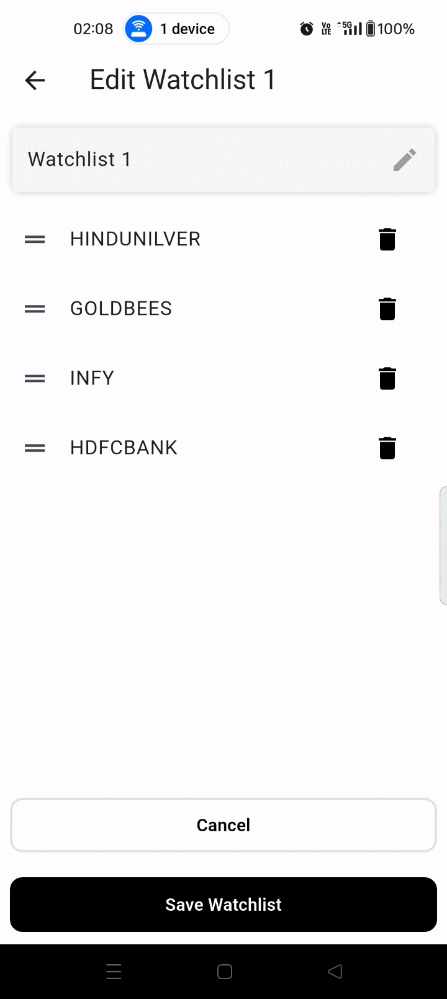

# Watchlist Flutter BLoC Assignment

This project is a sample Flutter application implementing a **Watchlist** feature similar to a trading app. Stocks in a watchlist can be dynamically updated, and the app uses **Flutter BLoC** for state management.

---

## Features

- Display multiple watchlists with stocks.
- Real-time updating of stock price, change, and percentage using a simulated stream.
- Swap stocks within a watchlist.
- UI/UX designed for responsiveness and clarity.
- Fully type-safe code using Dart null-safety.
- Clean project structure with separate layers (DataSource, Repository, UseCase, Bloc, UI).

---

## Architecture

The app follows **Clean Architecture**:

1. **Domain Layer**
   - Entities: `StockEntity`, `WatchlistEntity`
   - Repository abstraction: `WatchlistRepository`
   - UseCase: `GetWatchlistsUseCase`

2. **Data Layer**
   - Data source: `WatchlistRemoteDataSource` (dummy data)
   - Repository implementation: `WatchlistRepositoryImpl`

3. **Presentation Layer**
   - Bloc: `WatchlistBloc`
   - Events: `LoadWatchlists`, `ChangeWatchlist`, `UpdateWatchlist`, `StockUpdated`
   - States: `WatchlistState`
   - UI: Flutter screens & widgets for displaying watchlists and stocks.

---

## Watchlist Demo




---

## How to Run

1. Clone the repository:
```bash
git clone https://github.com/aniket312001/watchlist_flutter_bloc-assignment.git


